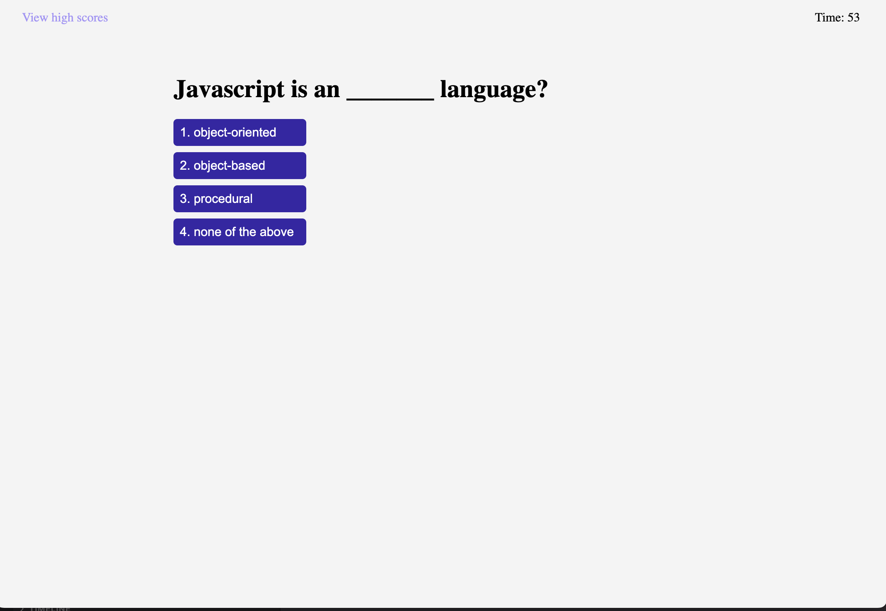

# Coding Quiz

## Description

In this assignment we were task to create a small coding quiz based on certain criteria.  The user is lands on the start quiz page that has a button to let them start a timed quiz.  They get 60 seconds to answer as many correct answers as they can.  The user will get 10 seconds deducted for every wrong answer.  Once the quiz is over they are brought to a screnn where they can save there initials and score. There is also a high score page the lists are the high scores in order from highest to lowest.  

## Repository

Link to deployed code:  https://jarrodkrauszer.github.io/coding_quiz/

## Technologies

 - We used a mixture of Javascript and HTML to create the pages
 - We are using Javascript to hide and show different divs on the main page
 - We are using Javascript to dynamically create the buttons for each question
 - We are also using localstorage to save and recall the high scores
 - Using flex on most of the divs for responsive design

## Mock-Up

The following image shows the web application's appearance and functionality:

